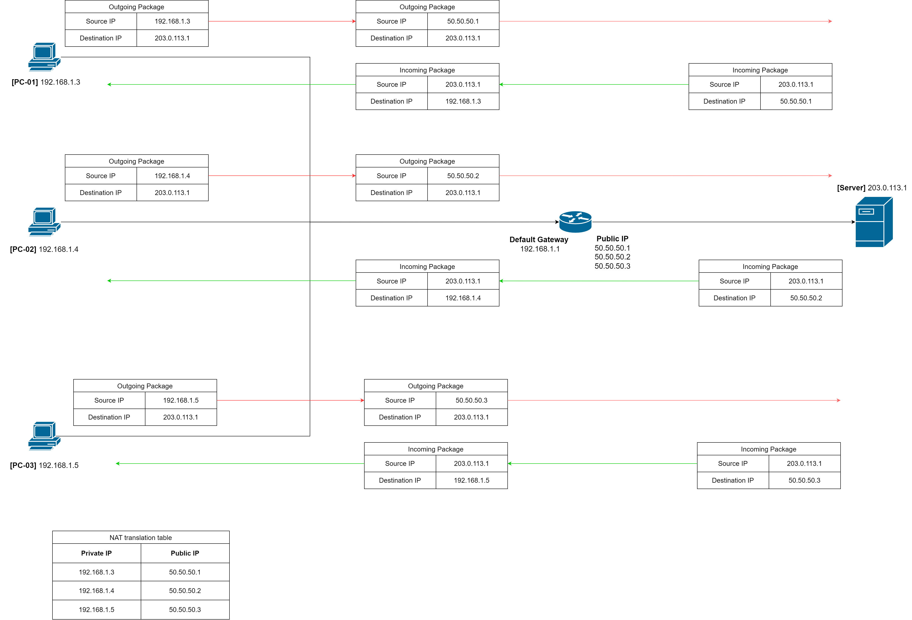

# Network Address Traslation

In a local network (Home, office, school or campus network, etc.), a device are configured to use it's private IP address, which is reserved for internal use and are not globally unique. As private IP address are not routable on the public internet, external IP address (globally unique) can not directly access it.

So, how can a device with private IP addresses within a local network access resources on the internet ?

The answer is NAT, which stands for **Network Address Translation**

## What is NAT ?

NAT (Network Address Translation) is a technique used in networking to enable a divice within a local network to use a single public IP address when communicating with external networks, such as the internet.

## How many types of NAT ?

NAT is classified into basic NAT and NAPT

### Basic NAT

Also called **one-to-one NAT**, the basic NAT map one private IP address with a unique public IP address.

On the other hand, if you have an number of devices on your internal network, you need a corresponding number of public IP addresses in order for all of them to access the internet.

Here's the visual illustrating how basic NAT operates:

### How can NAT perform address translation ?

Let's consider a scenario in which a small office network is using NAT to enable multiple devices to share a single public IP address for internet access.

Here's the network configuration for the small office:

* The small office has several devices such as computers, smartphones, and printers that need to access internet.
* The office network uses private IP address (e.g., in the range of 192.168.1.0/24) internally, such as:
  * Computer 1: 192.168.1.2
  * Laptop: 192.168.1.3
  * Smartphone: 192.168.1.4
* The office is assigned a single public IP address by the Interet Service Provider (ISP). Let's say the public IP address is 203.0.113.1
* The office has a router or gateway device that serves as the NAT device.

#### Private device sends a packet

* A device (e.g., computer 1) initiates communication by sending a packet to a destination on the internet through the NAT device.

#### Source Network Address Translation (SNAT)

* The NAT device (router or gateway) receives the packet and performs Source Network Address Translation (SNAT).
* The private source IP address in the packet header is replaced with the public IP address assigned by the NAT device.

#### Port Assignment (If using NAPT or PAT)

* If the NAT device is configured for Network Address Port Translation (NAPT) or Port Address Translation (PAT), it assigns a unique port number to the packet.

#### **NAT translation table**

* The NAT device creates an entry in its translatoin table, recording the mapping between the private IP address, private port (if applicable), public IP address **and** assigned port number

#### Packet sent to destination

* The NAT device forwards the packet to the destination on the internet.

#### Reply from destination

* When the destination server responds, it sends the reply packet to the public IP address and port number assigned by the NAT device.

#### Destination Network Address Translation (DNAT)

* The NAT device performs Destination Network Address Translation (DNAT)
