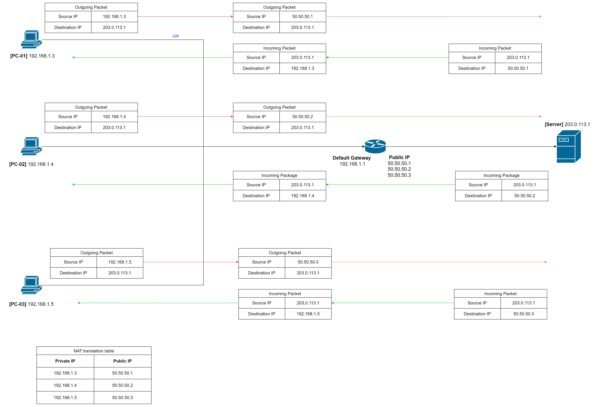

# Network Address Traslation

In a local network (Home, office, school or campus network, etc.), a device are configured to use it's private IP address, which is reserved for internal use and are not globally unique. As private IP address are not routable on the public internet, external IP address (globally unique) can not directly access it.

So, how can a device with private IP addresses within a local network access resources on the internet ?

The answer is NAT, which stands for **Network Address Translation**

## What is NAT ?

NAT (Network Address Translation) is a technique used in networking to enable a divice within a local network to use a single public IP address when communicating with external networks, such as the internet.

## How many types of NAT ?

NAT is classified into basic NAT and NAPT

### one-to-one NAT

Also called **Basic NAT**, the one to one NAT map one private IP address with a unique public IP address.

On the other hand, if you have an number of devices on your internal network, you need a corresponding number of public IP addresses in order for all of them to access the internet.

Here's the visual illustrating how basic NAT operates:

When a host in private network access a web server on the Internet, one-to-one NAT process in a NAT device (router, gateway device, etc.) as follows:

1. **Sending Packet**: The host sends a packet to the router, which contains:
   * Source IP address and destination IP address (within the IP header)
   * Source port number and destination port number (within the TCP header). We will not use this in this type of NAT.
2. **Source Network Address Translation (SNAT)**: After receiving the packet, the router only replaces the source IP address (in the IP header) with a unique public IP address (assigned by the Internet Service Provider, or ISP).
3. **Updating Translation Table**: The router then creates a mapping record of private IP address and corresponding public IP address in the NAT translation table and forwards the packet to the web server on the Internet.
4. **Destination Network Address Translation (DNAT)**: After receiving the response packet from the server, router searches the NAT translation table for record inserted in previous step, replaces the destination IP in the IP header of the packet with the corresponding private IP found in the table, and sends the packet back to the host device.

#### Use cases:

* Basic NAT is suitable for scenarios where two IP networks with incompatible addressing need to interconnect.
* It allows communication between devices in a private network with non-routable addresses and external networks with routable addresses.

However, one-to-one NAT cannot resovle the IPv4 address exhaustion. That's why the next type of NAT is more popular.
